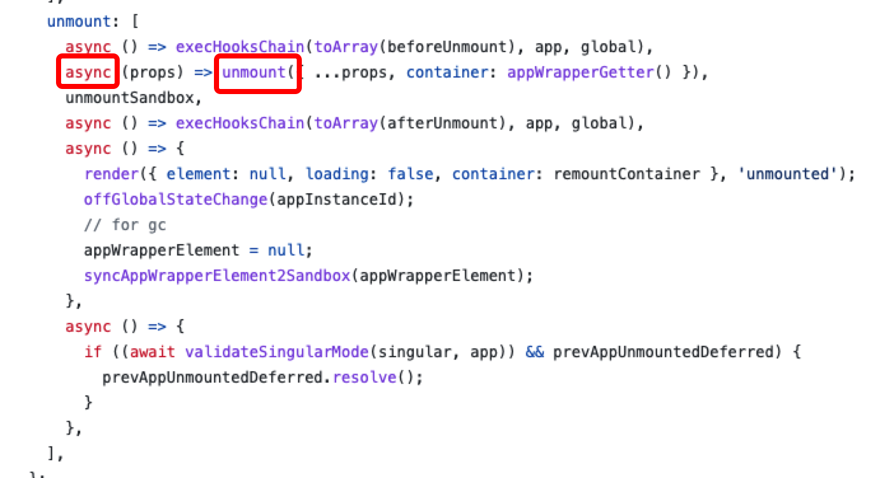
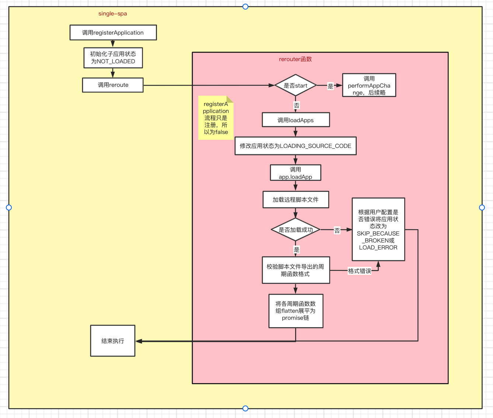

## 子应用各种状态

应用初始状态为`NOT_LOADED`

加载子应用远程脚本文件时为`LOADING_SOURCE_CODE`

1、加载成功，将状态改为`NOT_BOOTSTRAPPED`

2、加载失败，若是用户写的配置有问题则会抛出异常，并将状态改为`SKIP_BECAUSE_BROKEN`

3、加载失败，且不是用户配置问题，则将状态改为`LOAD_ERROR`

---

## 周期函数必须是 promise 格式

子应用的周期函数要是 promise，原因是在 loadApps 后会将周期函数数组通过 promise.then 的格式展平后链接为一个函数，此时 single-spa 会做前置的 promise 校验，以保证能够将所有周期函数链接。

single-spa 是提供了 single-spa-react，single-spa-vue 等辅助库帮助用户实现 promise 格式的周期函数。

用户若不用这个库，则需要自己封装成 promise 的格式。

qiankun 的子应用周期函数并不要求用户写成 promise 格式，原因是他内部会帮用户转成 promise 的格式。如下所示



---

## 注册子应用的具体流程



---

## single-spa 是如何根据路由变化切换和加载子应用的？

原理其实很简单，就是监听路由变化的事件和改变 api 即可。

single-spa 会在 navigation-event.js 文件中定义逻辑如下：

```js
// 监听路由变化，触发reroute
// We will trigger an app change for any routing events.
window.addEventListener('hashchange', urlReroute);
window.addEventListener('popstate', urlReroute);

// 修改原生history的方法，除了原生的历史记录，还会调用reroute
window.history.pushState = patchedUpdateState(window.history.pushState, 'pushState');
window.history.replaceState = patchedUpdateState(window.history.replaceState, 'replaceState');
```
